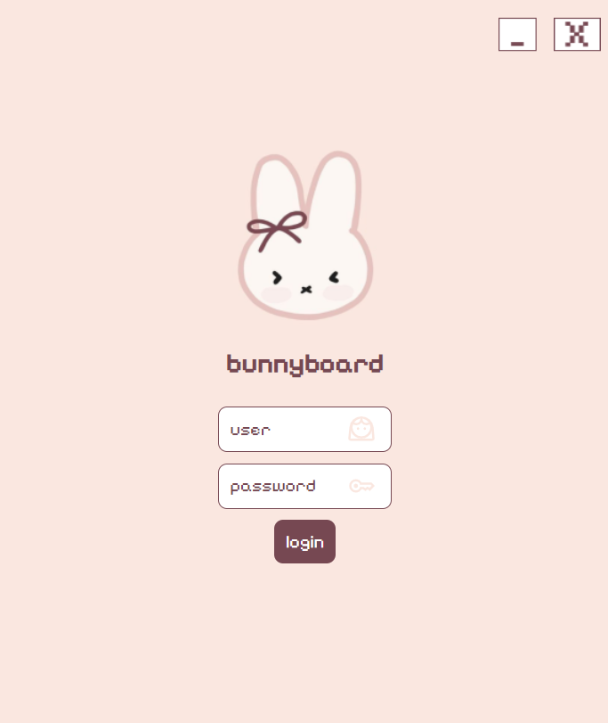
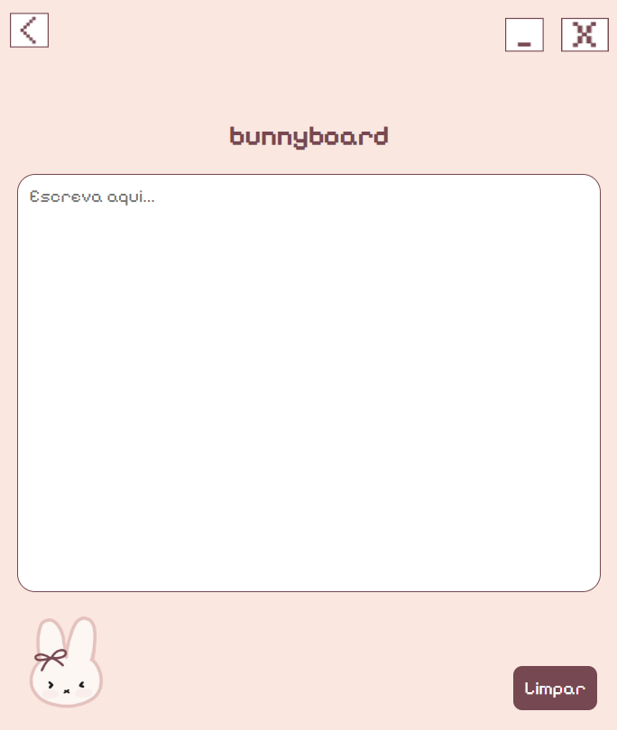

# Bunnyboard 🐰

Um editor de texto simples e fofo estilo lousa para anotações rápidas, construído com Electron. O projeto foca em uma interface minimalista e customizada, com uma estética pixel art.

## Screenshots

<p>
    
     
</p>

## Como rodar o projeto

Pré-requisito: **Node.js**

```
    cd bunnyboard
    npm install
    npm start
```
